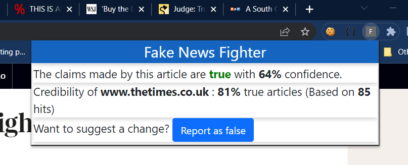

# Fake News Fighter
A Chrome extension to inform users of the truthfulness of a news article on a webpage and news website credibility scores. Powered by a machine learning model trained on multiple datasets from the CLEF fake news detection workshop and Kaggle.

## Environment Setup

#### Back-end Flask Server
To install the required Python libraries for the backend, run the command:
<pre><code>pip install -r requirements.txt</code></pre>

To start the server, run:
<pre><code>python service.py</code></pre>

#### Front-end Chrome Extension
To load the extension into Chrome, 

- Open the browser and visit <code>chrome://extensions/</code>. Turn on Developer mode if it's off.
- Click on "Load Unpacked" and select the <code>/chrome_extension/dist</code> folder.
- Make sure that the extension is enabled.

## Usage
To test if a news article has true or fake claims, open the article in Chrome and click on the "Fake News Fighter" icon from the extensions tray.

The extension provides the following information about the article:

- **Truthfulness classification** between "true" and "false" along with a **confidence score**.
- **Website Credibility score** indicating the "trustworthiness" of the website.
- Provision to incorporate **user feedback** in the above two measures.

The user feedback is taken into account while calculating the website credibility score for subsequent inferences. The records corresponding to extension hits are stored in <code>data/model_predictions.csv</code> and the feedback log is stored in <code>data/user_corrections.csv</code>. These files can be used to re-train the model and refine its predictions.

